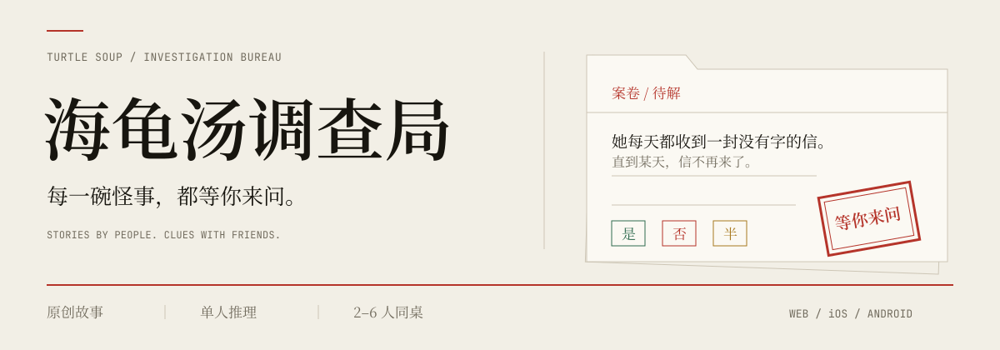
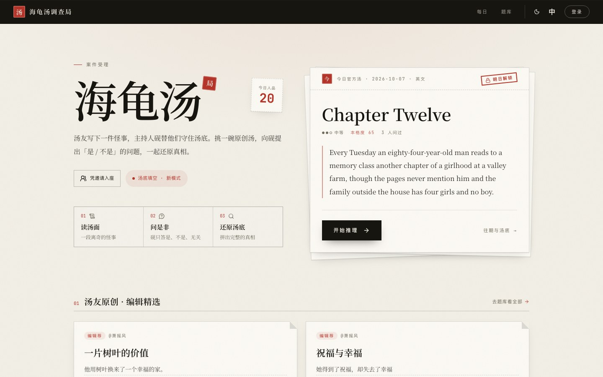
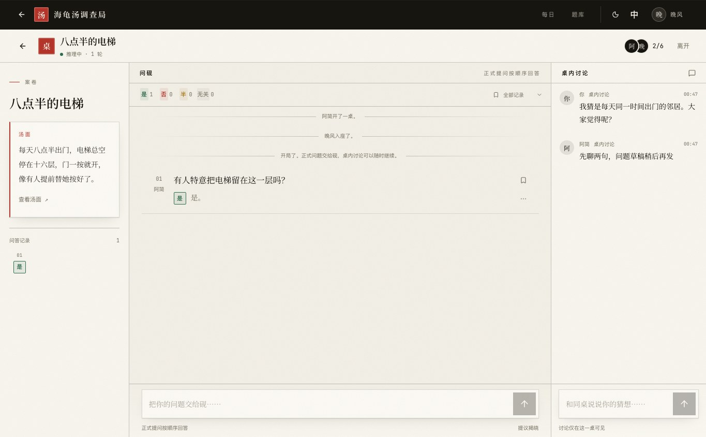
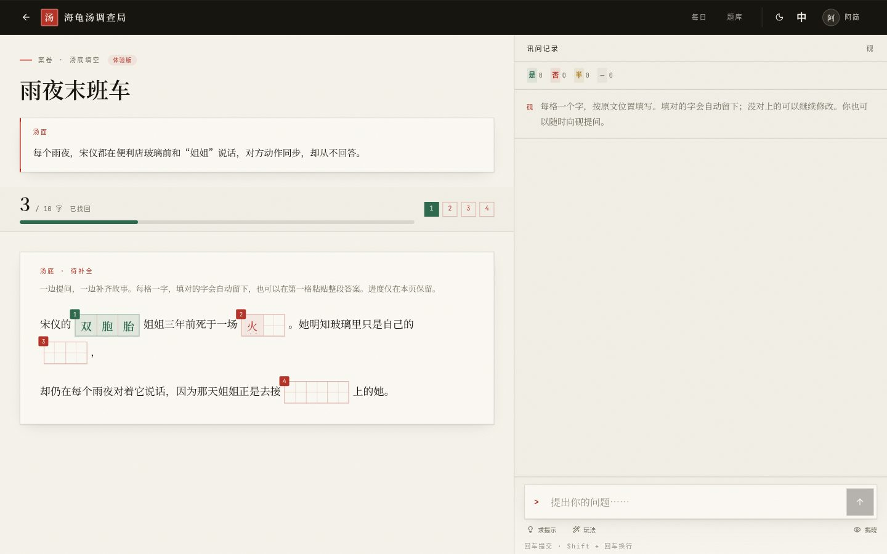
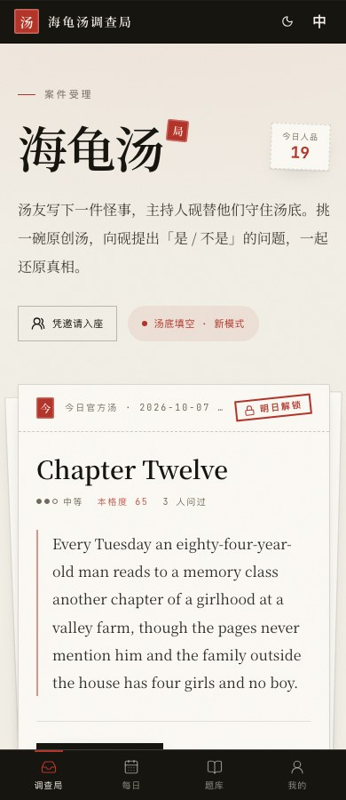
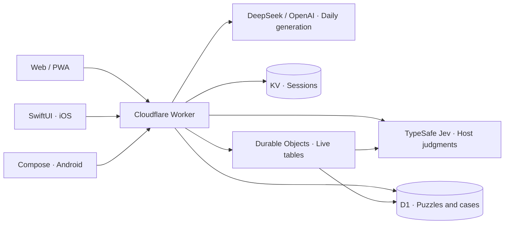

<p align="center">
  <picture>
    <source media="(prefers-color-scheme: dark)" srcset="docs/readme/banner-dark.svg">
    
  </picture>
</p>

<h1 align="center">Turtle Soup Investigation Bureau</h1>

<p align="center">
  <strong>Stories from the community. An AI keeper of the truth. Your questions.</strong><br>
  Solve a mystery on your own, invite friends to a table, or write the next case.
</p>

<p align="center">
  <a href="https://hgt.mmstudio.games"></a>
  <a href="https://github.com/HsiangNianian/jev-turtle-soup/releases/latest"></a>
  <a href="https://github.com/HsiangNianian/jev-turtle-soup/releases"></a>
</p>

<p align="center">
  <a href="https://hgt.mmstudio.games/library">Explore puzzles</a> ·
  <a href="https://hgt.mmstudio.games/daily">Daily mystery</a> ·
  <a href="https://github.com/HsiangNianian/jev-turtle-soup/releases">Get the test apps</a> ·
  <a href="CONTRIBUTING.md">Contribute</a>
</p>

<p align="center"><a href="README.md">简体中文</a> · <b>English</b></p>

---

## A strange story. A table of curious people.

**Turtle soup puzzles** are lateral-thinking mysteries. You start with a short, puzzling premise and ask the host questions until the hidden story makes sense. Here, stories come from community authors and daily official puzzles; **Ellis** (砚), the AI host, judges and answers your questions.

1. **Pick a mystery.** Browse the library, editor's picks, or today's puzzle.
2. **Ask a question.** Follow the yes, no, partly, and irrelevant answers. Keep useful clues and revise your theory.
3. **Reconstruct the story.** Close the case yourself, or send friends an invitation and reason it out together.

<p align="center">
  <picture>
    <source media="(prefers-color-scheme: dark)" srcset="docs/readme/home-dark.jpg">
    
  </picture>
</p>

## Inside the bureau

- **Discover and create** — Search community stories, visit author profiles, like and comment. Publish your own premise and solution for the next investigator.
- **Solve solo** — Ask Ellis, review the verdict ledger, and privately mark and filter useful exchanges. Guest cases stay on the device; sign in to sync them to your account.
- **Play with friends** — Share a real-time table with 2–6 players. Questions are answered in order while the discussion continues. Vote to reveal and keep a shared case archive.
- **Fill in the story** — Ask questions while restoring missing characters. Correct letters lock in place; authors select blanks directly in the editor. Currently web-only and single-player, with progress kept for the open page.
- **A daily mystery** — A new case is scheduled for 00:00 UTC. Today's solution cannot be manually revealed, but solving it closes the case. Past cases expose the solution and full background story.
- **A community for authors** — Spoiler-aware discussions, work statistics, and weekly author digests. Public shortest/longest solve counts exclude authors; manual-reveal counts are private to each puzzle's author.

### One person asks. Everyone thinks along.

On desktop, the premise, formal questions, and group discussion have their own columns. On phones, they become a continuous conversation: switch between asking Ellis and chatting with friends. Personal marks stay on your device.

<p align="center">
  
</p>

<details>
<summary><strong>More screenshots: story cloze and mobile web</strong></summary>

<p>Keep asking the host as you fill the blanks. The editor supports Chinese input methods, paste, and keyboard navigation.</p>


<p align="center">
  
</p>

</details>

## In your browser and in your pocket

Web, PWA, and both native clients share accounts and a backend. Warm paper, ink, red seals, and serif type carry through light and dark appearances. The interface supports Chinese, English, and Japanese.

- **Web / PWA** — [Open the bureau](https://hgt.mmstudio.games), or install it from your browser. Saved local cases can be read offline; new puzzles, sign-in, AI answers, and sync need a connection.
- **iOS** — Native SwiftUI test app. [Build and install](ios/README.md) · [Nightly](docs/ios-nightly-release.md). Physical iPhones need your Apple development signing; Release ZIPs are Simulator apps, not iPhone IPAs.
- **Android** — Native Kotlin + Jetpack Compose test app. [Build and install](android/README.md) · [Test downloads](https://github.com/HsiangNianian/jev-turtle-soup/releases/latest). Release APKs are debug-signed.

## Run locally

Use **Node.js 22.13+** and npm. Tool versions are recorded in [package-lock.json](package-lock.json).

```bash
git clone https://github.com/HsiangNianian/jev-turtle-soup.git
cd jev-turtle-soup
npm ci
cp .env.example .env
```

Set a local `AUTH_SECRET` in `.env` and supply `TYPESAFE_API_KEY` for the host. Daily generation also needs a DeepSeek, OpenAI, or compatible provider key.

```bash
npm run db:local       # For a NEW local database only
npm run dev:worker     # Full app: http://localhost:8787
```

Local sign-in displays the verification code instead of sending email. Login, library, and save development can run without model keys. A fresh database has no puzzles; sign in and submit one. For existing databases, follow the [upgrade guide](docs/development.md#数据库初始化与升级).

**Just exploring the interface?** Run `npm run rooms:preview` and open `http://localhost:8799`. This isolated preview includes sample puzzles, local data, and a simulated host, with no model keys required. See the [room checks](docs/rooms.md#可复现检查) for multi-account testing.

> `npm run dev` is the Vite hot-reload entry, with limited in-memory game APIs. Authentication, the library, dailies, cloud saves, and rooms need `npm run dev:worker`. See the [development guide](docs/development.md) for environment variables and commands.

## How it works

**React 19 · TypeScript · Vite · Tailwind CSS 4** power the web app; **SwiftUI** and **Jetpack Compose** power the native clients. All three use one **Cloudflare Worker** for accounts, puzzles, gameplay, and room services.



Judgments use the story stored on the server. Clients submit questions; the server manages room state, queues, and reveal permissions. Model credentials never go to clients. See [deployment and operations](docs/operations.md) for hosting, resources, and scheduled jobs.

## Develop and contribute

Contributions to gameplay, interaction design, translations, tests, and documentation are welcome. Report reproducible judgment or sync issues with the puzzle and exact question; mark solution details as spoilers.

```bash
npm test                 # Unit and integration checks with controlled network/model substitutes
npm run lint             # Static checks
npm run build            # Type checking and production frontend build
npm run deploy:dry-run   # Check Worker packaging without deploying
```

| Looking for                                                 | Start here                                                                                          |
| ----------------------------------------------------------- | --------------------------------------------------------------------------------------------------- |
| Local setup, database, repository layout                    | [Development](docs/development.md)                                                                  |
| Cloudflare hosting, schedules, APIs, save behavior          | [Operations](docs/operations.md)                                                                    |
| Room protocol, permissions, reconnects, multi-client checks | [Multiplayer rooms](docs/rooms.md)                                                                  |
| Compact gameplay and regression checks                      | [Play layout](docs/play-density.md)                                                                 |
| Scheduled author digests and manual delivery                | [Weekly digest](docs/weekly-digest.md)                                                              |
| Reporting issues or opening a PR                            | [Contributing](CONTRIBUTING.md) · [Issues](https://github.com/HsiangNianian/jev-turtle-soup/issues) |
| Recent changes                                              | [Changelog](CHANGELOG.md) · [Releases](https://github.com/HsiangNianian/jev-turtle-soup/releases)   |

The detailed development and platform guides are currently in Chinese. English issues and pull requests are welcome.

Thanks to [@muyuzhong](https://github.com/muyuzhong), [@YUZHEthefool](https://github.com/YUZHEthefool), [all contributors](https://github.com/HsiangNianian/jev-turtle-soup/graphs/contributors), and everyone who writes, plays, and reports a puzzle.

<p align="center"><sub>The next strange story is waiting for your questions.</sub></p>
