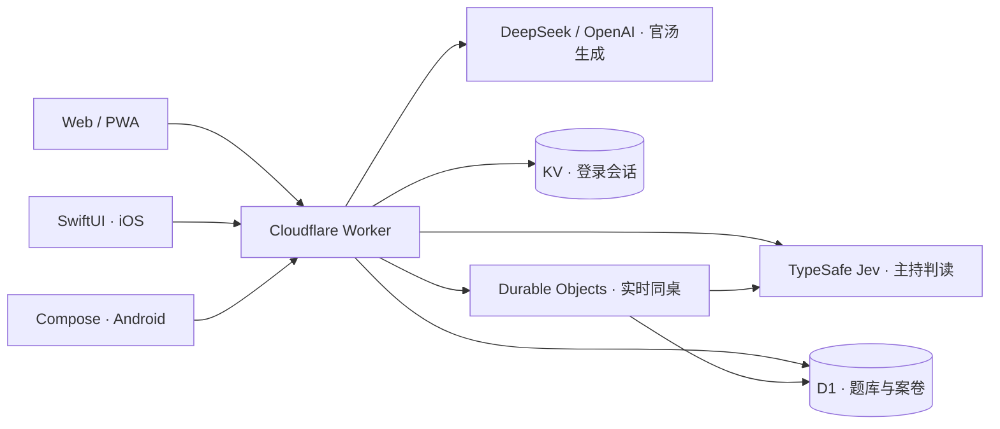

<p align="center">
  <picture>
    <source media="(prefers-color-scheme: dark)" srcset="docs/readme/banner-dark.svg">
    
  </picture>
</p>

<h1 align="center">海龟汤调查局</h1>

<p align="center">
  <strong>汤友写下怪事，砚守住真相。你来问，一起破案。</strong><br>
  一个可以独自推理、邀朋友同桌，也能亲手出题的海龟汤社群。
</p>

<p align="center">
  <a href="https://hgt.mmstudio.games"></a>
  <a href="https://github.com/HsiangNianian/jev-turtle-soup/releases/latest"></a>
  <a href="https://github.com/HsiangNianian/jev-turtle-soup/releases"></a>
</p>

<p align="center">
  <a href="https://hgt.mmstudio.games/library">挑一碗汤</a> ·
  <a href="https://hgt.mmstudio.games/daily">每日官汤</a> ·
  <a href="https://github.com/HsiangNianian/jev-turtle-soup/releases">下载测试 App</a> ·
  <a href="CONTRIBUTING.md">参与贡献</a>
</p>

<p align="center"><b>简体中文</b> · <a href="README.en.md">English</a></p>

---

## 一段离奇的事，一桌好奇的人

**海龟汤**是一种情境推理游戏：你先读到简短而反常的「汤面」，再向主持人提问，逐步还原隐藏的「汤底」。这里的故事来自汤友投稿与每日官汤，AI 主持人**砚**（Ellis）负责判读与回应。

1. **挑一碗汤。** 从题库、编辑精选或每日官汤开始。
2. **问一个问题。** 根据「是／不是／是也不是／无关」的回答，整理线索、修正猜想。
3. **还原真相。** 独自结案，或把邀请发给朋友，一起讨论到水落石出。

<p align="center">
  <picture>
    <source media="(prefers-color-scheme: dark)" srcset="docs/readme/home-dark.jpg">
    
  </picture>
</p>

## 在调查局里

- **发现与创作** — 浏览、搜索汤友原创，查看作者主页，点赞与留言。写下自己的汤面和汤底，发布给下一位调查员。
- **单人推理** — 向砚提问、查看是非记录、标记有用的问答并筛选回看。游客可保存本机案卷，登录后同步到账号。
- **朋友同桌** — 2–6 人实时游玩。正式提问依次回答，桌内讨论随时继续；共同决定是否揭晓，保留共同案卷。
- **汤底填空** — 一边提问，一边补全故事。填对的字会锁定；作者可直接点选或框选要挖空的文字。当前为网页单人体验，进度仅在当前页面保留。
- **每日官汤** — 每天 UTC 00:00 开新案，当天不能主动揭晓；成功解开可结案，次日可回看汤底与完整故事。
- **作者与社群** — 防剧透讨论、作品数据、作者周报。公开的最长／最短轮数只统计成功解开的玩家并排除作者；主动揭晓人数仅作者本人可见。

### 同桌：一个人提问，大家接着想

电脑端把案卷、正式问答和讨论放在三栏；手机端合为连续会话，随时切换「问砚」与「和大家聊」。个人标记只存本机，不会干扰同桌的线索。

<p align="center">
  
</p>

<details>
<summary><strong>再看一眼：汤底填空与手机网页</strong></summary>

<p>填空时仍可向砚提问；中文输入、粘贴和键盘导航均可使用。</p>


<p align="center">
  
</p>

</details>

## 从浏览器到口袋里

网页、PWA 与两个原生客户端共用账号和后端。纸白、墨色、朱红印章与衬线字体贯穿深浅两套外观；界面支持中文、英文和日文。

- **Web / PWA** — [直接打开调查局](https://hgt.mmstudio.games)，或在浏览器中安装到主屏幕。可离线阅读已保存的本机案卷；新题、登录、主持人判读和同步仍需联网。
- **iOS** — SwiftUI 原生测试 App。[构建与真机安装](ios/README.md) · [Nightly](docs/ios-nightly-release.md)。真机使用自己的 Apple 开发签名；Release ZIP 是模拟器 App，不是 iPhone IPA。
- **Android** — Kotlin + Jetpack Compose 原生测试 App。[构建与安装](android/README.md) · [下载测试包](https://github.com/HsiangNianian/jev-turtle-soup/releases/latest)。Release APK 使用调试签名。

## 本地跑起来

需要 **Node.js 22.13+** 与 npm；工具版本以 [package-lock.json](package-lock.json) 为准。

```bash
git clone https://github.com/HsiangNianian/jev-turtle-soup.git
cd jev-turtle-soup
npm ci
cp .env.example .env
```

在 `.env` 中设置本地 `AUTH_SECRET`，填入 `TYPESAFE_API_KEY` 后可使用砚的判读；每日生成还需要 DeepSeek、OpenAI 或兼容端点的密钥。

```bash
npm run db:local       # 仅用于新的本地数据库
npm run dev:worker     # 完整应用：http://localhost:8787
```

本地默认开启验证码展示，不发送邮件。不配置模型密钥也能调试登录、题库与存档；新数据库没有预置作品，可登录后自行投稿。已有数据库请按 [升级说明](docs/development.md#数据库初始化与升级) 处理。

**只想先看界面？** 运行 `npm run rooms:preview`，打开 `http://localhost:8799`。这是带示例题目的隔离预览，使用本地数据和模拟主持人，不需要模型密钥；多账号同桌验证见 [同桌说明](docs/rooms.md#可复现检查)。

> `npm run dev` 是 Vite 前端热更新入口，只提供有限的内存对局 API。登录、题库、每日汤、云存档与同桌需要 `npm run dev:worker`。环境变量和日常命令见 [开发指南](docs/development.md)。

## 它如何工作

**React 19 · TypeScript · Vite · Tailwind CSS 4** 构建网页；**SwiftUI** 与 **Jetpack Compose** 构建原生客户端。三端通过同一个 **Cloudflare Worker** 访问题库、账号、推理和同桌服务。



判读以服务端保存的故事为依据；客户端提交问题，同桌状态、提问队列和揭晓权限由服务端管理。模型密钥不交给客户端。部署、自建资源与三条定时任务见 [部署与运维](docs/operations.md)。

## 开发与贡献

欢迎改进玩法、交互、翻译和文档，也欢迎提交可复现的判读或同步问题。涉及汤底的反馈请标记剧透，附上题目与具体提问。

```bash
npm test                 # 单元与集成测试，使用受控模型／网络替身
npm run lint             # 静态检查
npm run build            # 类型检查与前端生产构建
npm run deploy:dry-run   # 检查 Worker 打包，不部署
```

| 想了解                                | 从这里开始                                                                                        |
| ------------------------------------- | ------------------------------------------------------------------------------------------------- |
| 本地环境、数据库、目录结构            | [开发指南](docs/development.md)                                                                   |
| Cloudflare 部署、Cron、接口与存档边界 | [部署与运维](docs/operations.md)                                                                  |
| 多人协议、权限、重连与多端验证        | [同桌模式](docs/rooms.md)                                                                         |
| 紧凑对局界面与回归检查                | [游玩布局](docs/play-density.md)                                                                  |
| 定时周报、手动发送与重试              | [作者周报](docs/weekly-digest.md)                                                                 |
| 提交问题或 PR                         | [贡献指南](CONTRIBUTING.md) · [Issues](https://github.com/HsiangNianian/jev-turtle-soup/issues)   |
| 最近有哪些变化                        | [Changelog](CHANGELOG.md) · [Releases](https://github.com/HsiangNianian/jev-turtle-soup/releases) |

感谢 [@muyuzhong](https://github.com/muyuzhong)、[@YUZHEthefool](https://github.com/YUZHEthefool) 与[所有贡献者](https://github.com/HsiangNianian/jev-turtle-soup/graphs/contributors)，也感谢每一位写汤、试汤、留下反馈的汤友。

<p align="center"><sub>下一碗怪事，等你来问。</sub></p>
